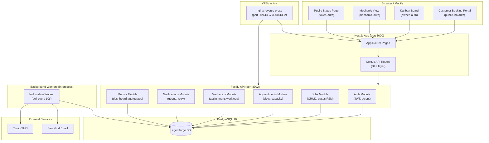

# Architecture: Repair-Shop Queue Management

## System Overview

The application is a full-stack TypeScript monorepo deployed as two processes (Next.js frontend + Fastify API) behind a single nginx reverse proxy on one VPS. PostgreSQL provides persistence. A background job worker (same Fastify process, separate queue) handles asynchronous notification delivery via Twilio (SMS) and SendGrid (email).

## High-Level Architecture Diagram



## Component Breakdown

### Frontend — Next.js 14 (App Router)

The frontend is a Next.js application using the App Router. It serves four distinct surfaces:

- **Customer Booking Portal** (`/book`) — a multi-step form (vehicle info → service selection → slot picker → confirmation). Fully server-rendered for SEO and accessibility. No authentication required.
- **Kanban Board** (`/dashboard`) — a client-side-rendered drag-and-drop board using `@dnd-kit/core`. Job cards are fetched via SWR with 10-second polling interval. Real-time updates are delivered via server-sent events (SSE) on the `/api/events` route.
- **Mechanic View** (`/mechanic`) — a simplified list view showing only the mechanic's assigned jobs. Includes a note editor and photo uploader. Auth-gated; redirects to `/login` if no session.
- **Public Job Status Page** (`/status/[token]`) — a read-only, server-rendered page accessible via a unique token. Shows status, latest mechanic note, and estimated ready time. No auth required.

**Key packages:** `next`, `react`, `@dnd-kit/core`, `swr`, `zod`, `tailwindcss`, `shadcn/ui`.

### Backend — Fastify API

The Fastify server exposes a REST API under `/api/v1`. It is structured as discrete Fastify plugins (modules), each registering its own routes, schemas, and hooks:

- **Auth Module** — issues and validates JWTs (HS256, 24-hour expiry). Handles `/login`, `/logout`, `/register`, and `/password-reset` routes. Passwords hashed with bcrypt (cost 12). Refresh tokens stored in `refresh_tokens` table.
- **Jobs Module** — core CRUD for the `jobs` table. Enforces the status finite-state machine: `waiting → in_progress → done` (and `in_progress → waiting` for reraise). Each transition is logged to `job_events`.
- **Appointments Module** — manages `appointment_slots` (capacity per day) and validates new bookings against available capacity. Creates a `Job` record atomically with the appointment.
- **Mechanics Module** — manages mechanic profiles and assignment logic. Enforces the 5-concurrent-job limit. Returns workload metrics used by the dashboard.
- **Notifications Module** — writes `notification_queue` records on every triggering event (job created, status changed). The worker polls this table and attempts delivery.
- **Metrics Module** — aggregates read-only dashboard data: daily/weekly throughput, average turnaround, notification volume.

**Key packages:** `fastify`, `@fastify/jwt`, `@fastify/multipart`, `pg`, `zod`, `bcryptjs`.

### Database — PostgreSQL 16

Single PostgreSQL instance. Connection managed via the `pg` driver with a pool size of 10. Migrations managed with a custom `pnpm db:migrate` script using sequential numbered SQL files in `packages/db/migrations/`.

### Notification Worker

Runs inside the Fastify process as a `setInterval` loop (10-second poll). Queries `notification_queue WHERE status = 'pending' AND next_attempt_at <= NOW()`. For each record, attempts delivery to Twilio or SendGrid, then marks the record `sent` or increments `attempt_count`. After 3 failures the record is marked `failed` and surfaced to the owner dashboard.

### Infrastructure — Single VPS + nginx

nginx acts as a TLS termination point and reverse proxy: `/api/*` routes to `localhost:4302`, everything else to `localhost:3000`. Let's Encrypt provides free TLS certificates. Static assets are served directly by nginx with a far-future cache header. Docker Compose is used for local development to spin up PostgreSQL.

## Data Flow: Appointment Booking

```mermaid
sequenceDiagram
    participant C as Customer Browser
    participant FE as Next.js
    participant API as Fastify API
    participant DB as PostgreSQL
    participant NQ as notification_queue
    participant W as Notification Worker
    participant SG as SendGrid

    C->>FE: POST /book (form data)
    FE->>API: POST /api/v1/appointments
    API->>DB: BEGIN; INSERT jobs; INSERT appointments; INSERT notification_queue; COMMIT
    API-->>FE: 201 { jobId, token }
    FE-->>C: Confirmation page
    W->>NQ: Poll pending notifications
    W->>SG: Send confirmation email
    SG-->>W: 202 Accepted
    W->>NQ: UPDATE status = 'sent'
```
