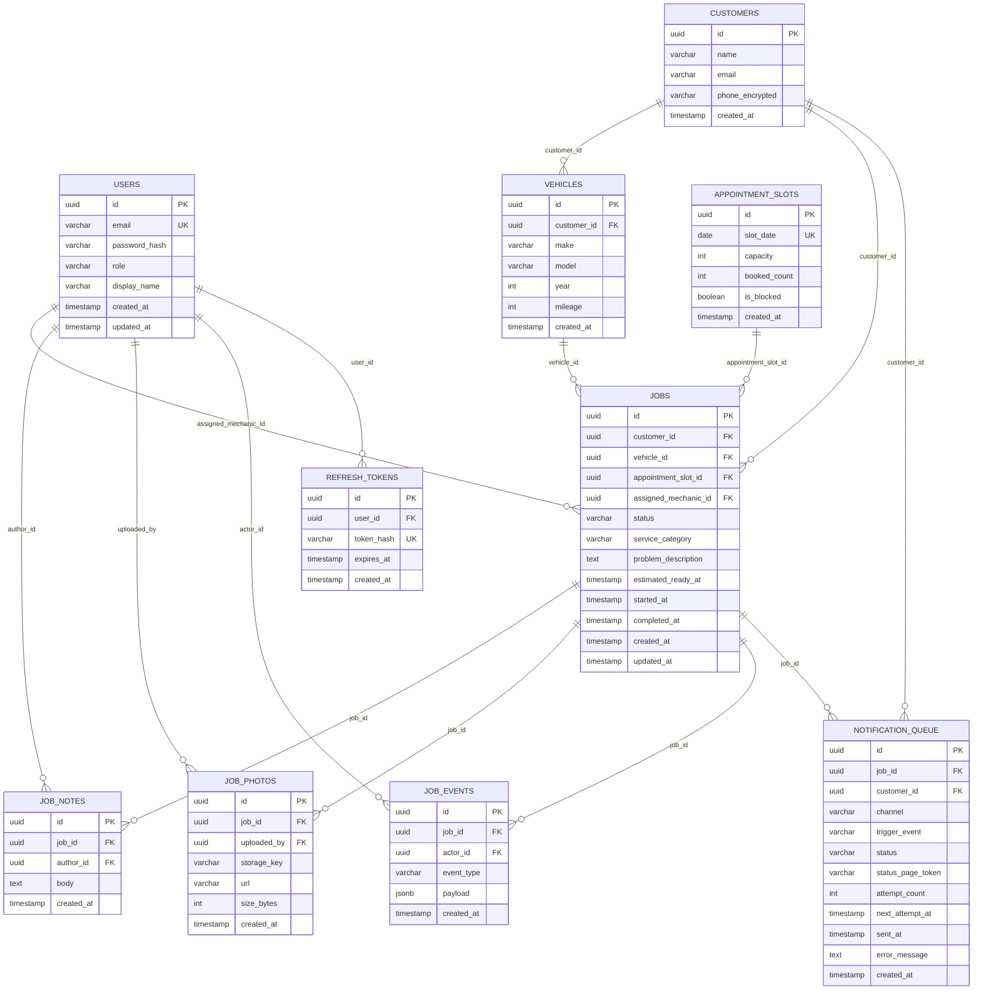

# Data Model: Repair-Shop Queue Management

## Entity-Relationship Diagram

## Table Definitions

### `users`

Stores shop owner and mechanic accounts. Customers are not users — they are stored separately in `customers` and access the system via token-authenticated links only.

| Column | Type | Constraints | Description |
|---|---|---|---|
| `id` | `uuid` | PK, default `gen_random_uuid()` | Surrogate key |
| `email` | `varchar(255)` | NOT NULL, UNIQUE | Login email |
| `password_hash` | `varchar(72)` | NOT NULL | bcrypt hash, cost 12 |
| `role` | `varchar(20)` | NOT NULL, CHECK (`owner`, `mechanic`) | RBAC role |
| `display_name` | `varchar(100)` | NOT NULL | Name shown in UI and notifications |
| `created_at` | `timestamptz` | NOT NULL, default `now()` | Account creation time |
| `updated_at` | `timestamptz` | NOT NULL, default `now()` | Last update (trigger-maintained) |

**Indexes:** `users_email_idx` UNIQUE on `email`.

---

### `customers`

Stores vehicle owner PII captured at booking time. Phone number is stored encrypted at rest using AES-256 (application-layer encryption; the raw value is never written to the DB).

| Column | Type | Constraints | Description |
|---|---|---|---|
| `id` | `uuid` | PK, default `gen_random_uuid()` | Surrogate key |
| `name` | `varchar(150)` | NOT NULL | Customer's full name |
| `email` | `varchar(255)` | NOT NULL | Contact email for notifications |
| `phone_encrypted` | `text` | NOT NULL | AES-256 encrypted phone number |
| `created_at` | `timestamptz` | NOT NULL, default `now()` | Record creation time |

**Indexes:** `customers_email_idx` on `email` (non-unique; same customer may book multiple times with same email but different records).

---

### `vehicles`

One vehicle per booking. If the same customer returns with the same car, a new vehicle record is created to avoid complex deduplication logic within the $50/month budget constraint.

| Column | Type | Constraints | Description |
|---|---|---|---|
| `id` | `uuid` | PK, default `gen_random_uuid()` | Surrogate key |
| `customer_id` | `uuid` | NOT NULL, FK → `customers(id)` | Owning customer |
| `make` | `varchar(80)` | NOT NULL | e.g. "Toyota" |
| `model` | `varchar(80)` | NOT NULL | e.g. "Camry" |
| `year` | `smallint` | NOT NULL, CHECK (year >= 1900 AND year <= 2100) | Model year |
| `mileage` | `int` | NOT NULL, CHECK (mileage >= 0) | Odometer at drop-off |
| `created_at` | `timestamptz` | NOT NULL, default `now()` | Record creation time |

---

### `appointment_slots`

One row per calendar date, controlled by the shop owner. When `is_blocked = true` the date is closed regardless of `capacity`.

| Column | Type | Constraints | Description |
|---|---|---|---|
| `id` | `uuid` | PK, default `gen_random_uuid()` | Surrogate key |
| `slot_date` | `date` | NOT NULL, UNIQUE | The calendar date |
| `capacity` | `smallint` | NOT NULL, default 8, CHECK (capacity > 0) | Max jobs the shop accepts on this date |
| `booked_count` | `smallint` | NOT NULL, default 0, CHECK (booked_count >= 0) | Incremented atomically when a job is created |
| `is_blocked` | `boolean` | NOT NULL, default false | Shop closed / holiday |
| `created_at` | `timestamptz` | NOT NULL, default `now()` | Row creation time |

**Constraint:** application-enforced: `booked_count` must not exceed `capacity` (checked inside a serializable transaction on booking).

---

### `jobs`

Central table. The `status` column drives the kanban board. Valid values: `waiting`, `in_progress`, `done`. All transitions are logged to `job_events`.

| Column | Type | Constraints | Description |
|---|---|---|---|
| `id` | `uuid` | PK, default `gen_random_uuid()` | Surrogate key |
| `customer_id` | `uuid` | NOT NULL, FK → `customers(id)` | Who owns the vehicle |
| `vehicle_id` | `uuid` | NOT NULL, FK → `vehicles(id)` | Which vehicle is being repaired |
| `appointment_slot_id` | `uuid` | NOT NULL, FK → `appointment_slots(id)` | The booked day |
| `assigned_mechanic_id` | `uuid` | FK → `users(id)` | NULL until assigned by owner |
| `status` | `varchar(20)` | NOT NULL, default `waiting`, CHECK (`waiting`, `in_progress`, `done`) | Current kanban column |
| `service_category` | `varchar(60)` | NOT NULL | e.g. "brake_repair", "oil_change", "engine_diagnostic" |
| `problem_description` | `text` | NOT NULL | Customer-supplied description |
| `estimated_ready_at` | `timestamptz` | | Optional ETA set by owner or mechanic |
| `started_at` | `timestamptz` | | Set when status transitions to `in_progress` |
| `completed_at` | `timestamptz` | | Set when status transitions to `done` |
| `created_at` | `timestamptz` | NOT NULL, default `now()` | Booking submission time |
| `updated_at` | `timestamptz` | NOT NULL, default `now()` | Last any-column update (trigger-maintained) |

**Indexes:** `jobs_status_idx` on `status`; `jobs_mechanic_idx` on `assigned_mechanic_id`; `jobs_slot_idx` on `appointment_slot_id`.

---

### `notification_queue`

Outbound notification records polled by the background worker. One row per notification event (appointment confirmation, status change to `in_progress`, status change to `done`).

| Column | Type | Constraints | Description |
|---|---|---|---|
| `id` | `uuid` | PK, default `gen_random_uuid()` | Surrogate key |
| `job_id` | `uuid` | NOT NULL, FK → `jobs(id)` | Related job |
| `customer_id` | `uuid` | NOT NULL, FK → `customers(id)` | Recipient |
| `channel` | `varchar(10)` | NOT NULL, CHECK (`sms`, `email`) | Delivery channel |
| `trigger_event` | `varchar(30)` | NOT NULL | e.g. `job_created`, `job_in_progress`, `job_done` |
| `status` | `varchar(10)` | NOT NULL, default `pending`, CHECK (`pending`, `sent`, `failed`) | Delivery status |
| `status_page_token` | `varchar(64)` | NOT NULL | 128-bit random token embedded in the notification URL |
| `attempt_count` | `smallint` | NOT NULL, default 0 | Delivery attempts made |
| `next_attempt_at` | `timestamptz` | NOT NULL, default `now()` | Earliest time worker may re-attempt |
| `sent_at` | `timestamptz` | | Set on successful delivery |
| `error_message` | `text` | | Last error from provider, if any |
| `created_at` | `timestamptz` | NOT NULL, default `now()` | Enqueue time |

**Indexes:** `notif_status_attempt_idx` on `(status, next_attempt_at)` WHERE `status = 'pending'` (partial index for fast worker polling).
